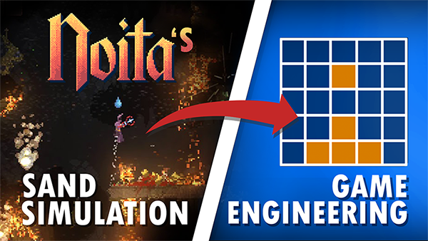

## Game Engineering | Episode 01 - Recreating Noita's Falling Sand Simulation

  

https://www.youtube.com/watch?v=VLZjd_Y1gJ8

Inspired by Noita, this is a simple "falling sand" simulation to demonstrate the mechanics and ideas behind Cellular Automata. 

## Building

**NOTE(john)**: Currently requires at least **OpenGL v3.3** to run. This will be addressed in the future to allow for 
          previous opengl versions. 

  - **windows**:
    - You'll need to have Visual Studio 2015 or greater.
    - From start menu, search for "x64 Native Tool Command Prompt for {Insert your Version Here}"
    - Navigate to where you have `EP01_SandSim` repo placed
    - run `proc\win\compile_win_cl.bat`
    - The executable will be placed in `bin\`
    - run `bin\SandSim.exe`
  - **mac**:
    - You'll need gcc
    - From the terminal, `cd`into the root directory for this project.
    - run `bash ./proc/osx/compile_osx_gcc.sh`
    - The exectuable will be placed in `bin/`
    - run `./bin/SandSim`
  - **linux**: 
    - You'll need gcc
    - From the terminal, `cd` into the root directory for this project.
    - run `bash ./proc/linux/compile_linux_gcc.sh`
    - The exectuable will be placed in `bin/`
    - run `./bin/SandSim`

## Controls
  - `[`: Decrease paint tool radius
  - `]`: Increase paint tool radius
  - `c`: Clear canvas of all particles
  - `i`: Enable/Disable all UI
  - `p`: Pause simulation
  - `b`: Enable/Disable post-processing
  - `esc`: Quit application
  - Left click mouse to `paint` particles into scene
  - Right click mouse to erase particles from scene
  - The user can drag & drop images into the program. Any `.png`, `.jpeg/.jpg` images will work. 

